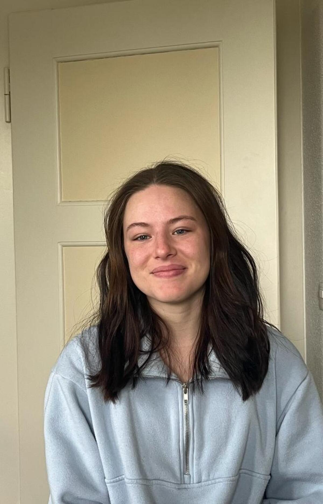

+++
title = "Reportage über Mobbing Erlebnis"
date = "2023-05-04"
draft = false
pinned = false
image = "oip.jpeg"
description = "Die verheerenden Auswirkungen von Mobbing, nach einem Mobbing Erlebnis."
+++
# **Hass statt Harmonie: Die verheerenden Auswirkungen von Mobbing**

\-Reportage von Annina Beck



Mobbing ist kein neues Phänomen, doch seine Auswirkungen sind nach wie vor verheerend. Tagtäglich werden Menschen auf der ganzen Welt Opfer von Schikane, Ausgrenzung und Gewalt, sei es in der Schule, am Arbeitsplatz oder online. Aline Probst gehörte dazu, denn sie erlebte selbst Mobbing während ihrer Schulzeit. Doch wie verändert sich ein Mensch durch Mobbing?



Graue Zeiten schwirren durch den Kopf von Aline Probst, wenn sie an ihre Schulzeit denkt, denn ihre Erinnerungen sind geprägt von permanenten Beleidigungen und Beschimpfungen, die sie sich von ihren damaligen Mitschüler*innen anhören mussten.

Es war Freitag als Aline mir ihre Geschichte erzählte. Die Sonne schien und die kleine Schanze in Bern lebt, fröhliches Gelächter und andere Menschen, die sich Geschichten erzählen. Obwohl Aline eine schwere Schulzeit hatte, wodurch selten ein Lächeln ihr Gesicht zum Strahlen brachte, wirkt sie heute fröhlich und lacht mir zu. Jeden Tag war die damals 11-jährige Aline glücklich, aufgestellt und ging gerne in die Schule. Bis Beleidigungen und Beschimpfungen ihre Welt auf den Kopf stellten. Sie erzählt mir, dass ihre Mitschüler*innen, als sie elf Jahre alt war, angefangen haben sie aufgrund ihrer Körpergrösse zu beleidigen und auszugrenzen. Eine angespannte Stimmung spüre ich, denn dieses Mobbing-Kapitel ist eine langsam heilende Narbe, die ich nicht aufreissen will.

**Allein im Kampf gegen Mobbing**

«Du bist zu klein!» In etwa so begann die ganze Geschichte, erzählt mir Aline. Ich erkenne, während sie spricht, in ihrem Gesichtsausdruck, dass sie unsicher ist und nicht weiss, ob es mittlerweile lächerlich ist, was damals geschah oder doch immer noch belastend.  Es ist kein leichtes Thema für sie, denn solange her ist es nämlich nicht. Das Mobbing begann, als sie elf Jahre alt war. Ihre Körpergrösse war das Problem, denn sie war kleiner im Vergleich zu ihren Mitschüler*innen, aufgrund dessen musste sie sich immer wie mehr Beleidigungen und Beschimpfungen anhören.  In den meisten Fällen wird eine Person von mehreren Personen gemobbt, wodurch das Opfer allein ist im Gegensatz zu dem Täter oder der Tätergruppe. Dadurch kann sich der Haupttäter, beziehungsweise der Anführer einer Mobbinggruppe stärker und mächtiger fühlen. Auch Aline war meistens allein und hatte wenig Freunde. Wenn sie Freunde hatte, stellte sie sich dann die Frage, ob es wahre Freunde sind oder etwa solche, die hinter ihrem Rücken über sie lästern. Mobbing unterscheidet man in indirekte oder direkte Angriffe, wobei indirekte Angriffe nicht vor der Person, die gemobbt wird, stattfindet sondern im Hintergrund, dazu gehört beispielsweise verbreiten von Gerüchten. Zu direkten Angriffen gehören Beschimpfungen, Drohungen, Blossstellen und Ignorieren. Aline erlebte indirekte sowie direkte Angriffe, wobei die direkten in Form von Beleidigungen wie «Du Bitch», körperliche Angriffe oder Morddrohungen, die sie später über die Sozialen-Medien zugesendet bekam.



Mobbing ist ein Psychoterror mit der Intention, dem Opfer zu schaden, es auszugrenzen und abzuwerten. Jemand wird gemobbt, wenn diese Person von einer Gruppe über einen längeren Zeitraum wiederholt, gedemütigt oder schikaniert wird. In der Schweiz sind hochgerechnet ungefähr 1.7 Millionen Menschen von Mobbing betroffen.





Aline Probst ist 20 Jahre alt und lebt in Rubigen, wo sie auch aufgewachsen ist. Nach der obligatorischen Schulzeit besuchte sie die FMS in Thun, um heute an der PH Bern die Ausbildung zur Kindergärtnerin zu machen. Während ihrer Schulzeit wurde sie gemobbt von ihren Mitschüler*innen.



**Durch ungefragte Kommentare schwerwiegende Krankheiten auslösen**  

Durch solche Erfahrungen verändert sich ein Mensch. Auch Aline veränderte sich. Zuerst Verwirrung doch dann Traurigkeit, die zunimmt, die Selbstsicherheit, die abnimmt und Lebensfreude, die am Morgen beim Aufstehen nicht mehr vorhanden ist. Aline zog sich mehr und mehr zurück, selten lieg ihr ein Lächeln auf den Lippen, sie verschloss sich und bekommt Probleme dabei neue Menschen kennenzulernen, ohne Unsicherheiten, die ihren Kopf dabei schwer machen. Weniger essen, weil der Appetit schon lange vergangen ist. Jetzt wirkt sie nachdenklicher und sagt «Es ist hart, daran zu denken und erneut zu realisieren, dass das alles mir passierte.» Im Hintergrund hört man kleine Kinder, die umherspringen und zusammen lachen, während wir über etwas sprechen, was dem Gegenteil davon entspricht, nämlich nicht mit anderen Kindern draussen sein und lachen, sondern eingeschüchtert sein und am liebsten den Nachmittag allein im Zimmer verbringen. Je länger jemand gemobbt wird, desto schwerwiegender sind die Folgen. Konzentrationsprobleme, Nervosität, Beeinträchtigung des Selbstwertgefühls, Schlafstörungen, Angst und Panik, Burnout, Suizidgedanken, Essstörungen, Depressionen oder auch Erkrankungen wie Magen-Darm oder Herz-Kreislauf Erkrankungen können durch Mobbing ausgelöst werden.

> *«Es fällt mir schwer Vertrauen aufzubauen, denn ich weiss nicht, wer es ernst meint mit mir.»*

**«Aber wieso?»**

Immer wieder kommt in mir die Frage auf welche Gründe ein Mobbingtäter hat, um jemanden zu mobben. Laut meiner Recherche sind Gründe für Mobbing Minderwertigkeitsgefühle, die der Täter mit sich trägt, aber sich dann durch seine Mobbing Aktionen besser fühlen kann oder auch stärker, wenn sie Macht auf jemanden ausüben können. Durch Erniedrigungen im eigenen Umfeld, kann sich das Bedürfnis entwickeln, andere Menschen auch zu erniedrigen. Häufig kommt es vor, dass die Mobbing Täter selbst unzufrieden sind in ihrem Leben, aber auch neidisch auf dieses, welches das Mobbing-Opfer lebt und somit dann mit Mobbing dafür sorgen, dass diese Person auch unzufriedener sein kann. Aline wusste die Motive des Täters nicht, nur dass es aufgrund ihrer Körpergrösse begann. Die Beleidigungen und Beschimpfungen begleiteten sie bis in die FMS. Nun spüre ich leichte Trauer, denn ihre ganze Schulzeit wurde davon geprägt, weil sich immer wieder neue Menschen der Mobbing Gruppe anschlossen und die Mitschüler*innen aus ihrer ehemaligen Klasse in Rubigen mit nach Münsingen in die Oberstufe kamen und später auch auf Thun in die FMS. «Das war mühsam» erklärt sie mir, weil sie sich freute auf einen Schulwechsel, um neu zu starten aber die Schulpläne ihr ein Strich durch die Rechnung machten, denn was verbessert die Schulzeit nicht mehr als gute Freunde, mit denen man Zeit verbringen und großartige Erinnerungen sammeln kann. Das fehlte ihr und machte die Schulzeit schwerer.

**Wie endet ein solcher Albtraum?**

«Ein Gespräch mit den Lehrpersonen ist für nichts» sagt Aline enttäuscht, denn als sie mit Hilfe ihrer Eltern das Gespräch mit den Lehrpersonen aufsuchte, sagten diese nichts anderes als: Alle beide sollen sich beieinander entschuldigen. Aber warum es dazu gekommen ist und wie sie es wirklich stoppen könnten interessierte sie nicht. Die Eltern von Aline setzten sich jedoch sehr für sie ein und versuchten alles, um ihre Lebensfreude zurückzubringen. Mit den Jahren, in denen Aline älter wurde, in die FMS kam und schon Jahre von Mobbing betroffen war, bemerkte sie, dass es Sinnlos ist sich noch dafür zu interessieren. So begann sie es zu ignorieren, wodurch nach und nach die Mobbingangriffe aufhörten. Ich merke, wie selbstbewusst sie das sagt und sie trotz allem etwas fürs Leben daraus gelernt hat, denn sie sagt «Interessier dich nicht für eine unangebrachte Meinung von anderen.»

> *"Die Symptome von Angst gehen in dem Moment weg, wo du ihnen die Aufmerksamkeit nimmst."*
>
> \-Manuel Cortez