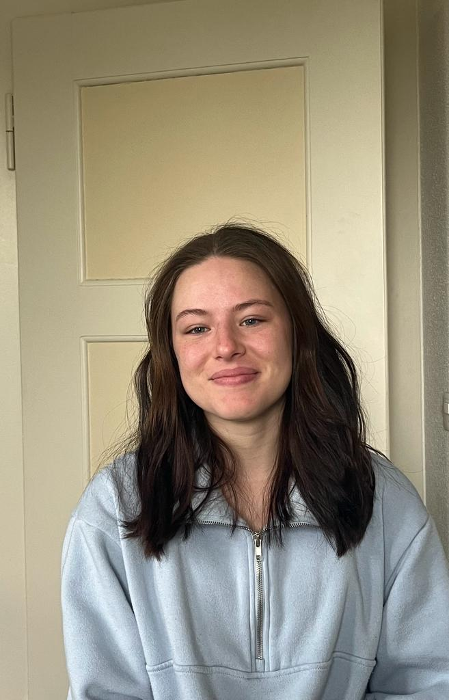
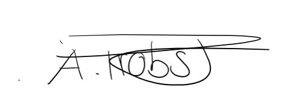

+++
title = "Wie verändert sich ein Mensch durch eine Mobbing Erfahrung?"
date = "2023-03-19"
draft = false
pinned = false
image = ""
description = "Interview über Mobbingerfahrung. "
+++
# **"All das begann aufgrund meiner Körpergrösse"**

## **Wörter haben eine grosse Macht. Sie können jemanden verletzen oder jemandem gut tun. Doch wie verändert sich eine Person durch Mobbing? Über dieses Thema habe ich mit Aline Probst gesprochen, denn in ihrer Schulzeit wurde sie gemobbt und diese Erfahrung teilte sie mit mir in diesem Interview.**

\- Interview von Annina Beck                                                                                                                                                            

**Wann begann das Mobbing?**                                                                                                                                   Es fing an, als ich in der ersten Klasse war, also noch in der Primarschule.

**Was waren typische Beleidigungen oder Kommentare, die du dir anhören musstest?**                            Meistens ging es um meine Körpergrösse. Ich war eher kleiner im Vergleich zu den anderen und musste mir deswegen zu Beginn Sprüche über meine Grösse anhören. Als ich dann älter wurde kamen typische Beleidigungen dazu, wie «du Bitch».

**Wie hast du darauf reagiert?**                                                                                                                                  Ich war sehr traurig, vor allem als ich noch jünger war, weil ich es auch nicht verstanden habe. Jedoch wurde es schlimmer, wodurch ich auch Gespräche hatte mit meinen Eltern, mit den Eltern von den Kindern die mich gemobbt haben, sowie mit den Klassenlehrpersonen. Das hat dann aber eher Kreise gezogen, wodurch die ganze Situation nicht besser wurde, sondern eher schlimmer, denn die Kinder benutzten das dann wieder um weitere Kommentare zu bringen wie zum Beispiel «Sie plaudert es Zuhause aus», «Sie kommt nicht damit klar» oder auch «Sie nimmt es zu ernst». Daraufhin hörte ich auf all das, was geschah zuhause zu erzählen.

**Was waren erste Gedanken oder hattest du auch Sorgen?**                                                                                                                                                           Ja. Ich hatte viele Sorgen. Auch um mich. Denn obwohl ich eine sehr Selbstbewusste Person war, wurde ich immer mehr unsicher. Dies änderte sich damit, dass ich an mir begann zu zweifeln und mir Fragen stellte wie, ob ich gut genug bin. Eine Sorge war auch, dass ich Angst hatte nie wahre Freunde zu finden, denn ich hatte nicht viele Freunde und auch wenn, dann waren es falsche Freunde, die dann hinter meinem Rücken trotzdem über mich gelästert hatten, wodurch ich mich oft allein, verloren oder auch hintergangen gefühlt habe. Dadurch, dass ich aufgehört habe, alles, was geschah zuhause zu erzählen fühlte ich mich auch noch allein und musste selber mit meinen Problemen auskommen. Das war für mich sehr schwierig.

> ### ***"Ich fragte mich, ob das Leben wirklich lebenswert ist oder sein wird."***
>
> **\*-**  **Gesagt von Aline Probst.***
>
>

**Aline Probst** ist 20 Jahre alt und lebt in Rubigen, wo sie auch aufgewachsen ist. Nach der obligatorischen Schulzeit besuchte sie die FMS in Thun, um heute an der PH Bern die Ausbildung zur Kindergärtnerin zu machen. Während ihrer Schulzeit wurde sie gemobbt von ihren Mitschüler*innen.

**Hattest du Unterstützung?**                                                                                                                                    Von meinen Eltern hatte ich immer Unterstützung. Sie hatten sich viel für mich eingesetzt und versucht das Mobbing zu stoppen, indem sie den Eltern von den Kindern die gemein waren angerufen hatten, um darüber zu sprechen oder mit den Lehrpersonen das Gespräch suchten.  Auch sonst munterten sie mich immer auf, wenn ich oft weinend nach Hause kam, da es auch auf das Körperliche weiterging.

**Du sagst, es gab auch Körperliche Vorfälle, schlugen die Kinder dich oder was meinst du damit?**                                                                                                                            Nein sie schlugen mich nicht, aber im Winter zum Beispiel füllten sie Schneebälle mit Steinen, die sie mir dann angeworfen hatten oder anderen Unsinn.

**Welche Folgen hatte es? Fingst du an dich zu verändern?**                                                                                   Im ersten Moment veränderte ich mich innerlich, also ich war sehr traurig, nicht mehr glücklich wie ich es einst immer war. Ich ging nicht mehr nach draussen, also blieb ich meistens einfach im Zimmer. Oft ass ich nichts mehr oder vermied das Gespräch zu anderen Menschen. Ich wurde sehr ruhig, obwohl ich eigentlich immer aufgestellt, glücklich und eher laut war, was aber auch von den Mitschüler*innen kritisiert wurde, was auch erklärt warum ich mich dann so verändert habe.  Ich fühlte mich auch alleine, weil ich aufgehört habe alles, was geschah zuhause meiner Familie zu erzählen. Ich denke im Äusserlichen wurde ich gut, darin es zu verstecken, dass es mir innerlich nicht gut ging, weil irgendwann ist man es auch leid, dass das Mobbing zur Persönlichkeit gehörte oder wurde und das will man nicht äusserlich zeigen, da ich nicht wollte, dass dies mich definiert.

**Was denkst du heute über deine damalige Veränderung?**                                                                                  Ich finde es sehr schade, wie das Mobbing mich veränderte, denn wenn man Fotos anschaut von damals, sieht man, dass ich vor der Schule immer aufgestellt, glücklich und Lebensfreude hatte. Diese Lebensfreude verlor ich mit der Zeit immer mehr. Ausserdem sind Probleme, wie Vertrauensprobleme entstanden, die mich heutzutage immer noch begleiten und ich sie auch nicht so schnell loswerde. Das ist schade und traurig zugleich, weil ich weiss, dass ich von Natur aus eigentlich das Vertrauen sehr schnell in die guten Menschen gefunden hatte und auch ziemlich offen wahr, was jetzt eher umgekehrt ist, also das ich sehr vorsichtig wurde.

**Wie endete das Mobbing?**                                                                                                                                           Es hat eigentlich nie wirklich geendet, denn das Mobbing lief immer mehr aus dem Ruder, so dass wir beinahe die Polizei einschalten mussten aufgrund von Morddrohungen. Trotzdem versuchte ich, da es mich über eine lange Zeit begleitete, irgendwann es einfach zu ignorieren.

> ### ***Wörter können jemanden verletzen oder heilen, es kommt ganz darauf an welche du wählst.*** 
>
> ***\- Spruch aus Pinterest von Cherokee Billie Spiritual Advisor .***

